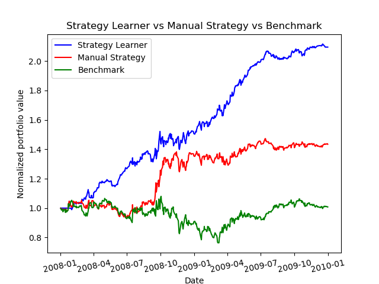

# ML4T_2020Fall

This repository includes the projects of CS7646: Machine Learning for Trading course at GeorgiaTech.

The final project "strategy_evaluation" implemented a manual trading strategy and a machine learning based strategy learner. The manual strategy manually sets up trading rules based on 4 of the stock indicators implemented in the project "indicator_evaluation". The strategy learner automatically choose the trading actions by training a random forest learner and build the trading rules.

The trading strategies is backtested and compared with the market simulater implemented in project "marketsim". 

Project 1: [Martingale](martingale/)
Project 2: Optimize Something
Project 3: Assess Learners
Project 4: Defeat Learners
Project 5: Marketsim
Project 6: Indicator Evaluation
Project 7: Qlearning Robot
Project 8: Strategy Evaluation
